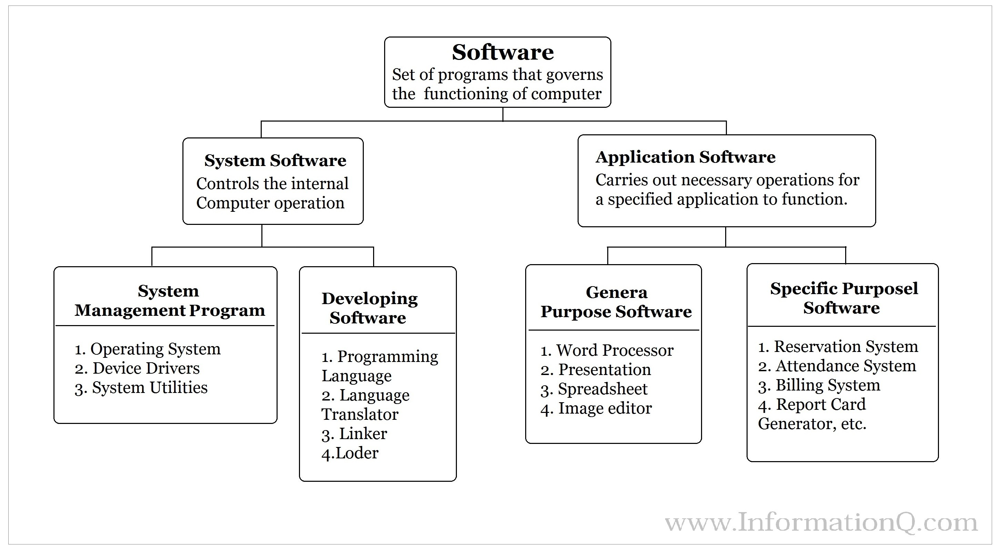

# Classification of it-products
Here is a classification of it-products that I found and found useful.

## Copyright status
* Free software
* Open source software
* Copylefted software
* Non-copylefted free software
* Shareware
* Freeware

## Market-based categories
* Accommodation and Food Services
* Administrative and Support
* Agriculture, Forestry and Hunting
* Arts, Entertainment, and Recreation
* Construction
* Educational Services
* Finance and Insurance
* Health Care and Social Assistance
* Information
* Internal and proprietary line-of-business applications
* Management of Companies and Enterprises
* Manufacturing
* Mining, Quarrying, and Oil and Gas Extraction
* Postal and Mailing
* Professional, Scientific, and Technical Services
* Public Administration
* Real Estate, Rental and Leasing
* Retail Trade
* Utilities
* Waste Management and Remediation Services
* Wholesale Trade
* Transportation and Warehousing
* Other Services (except Public Administration)

## Microsoft TechNet and AIS Software categories
* Platform and management
* Education and reference
* Home and entertainment
* Content and communications
* Operations and professional
* Product manufacturing and service delivery